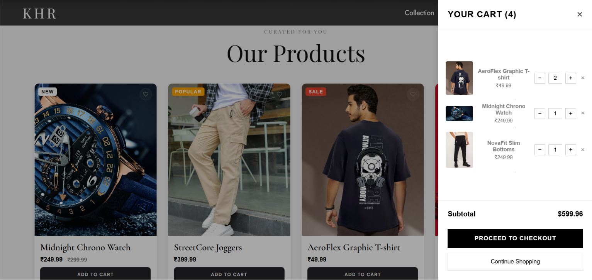
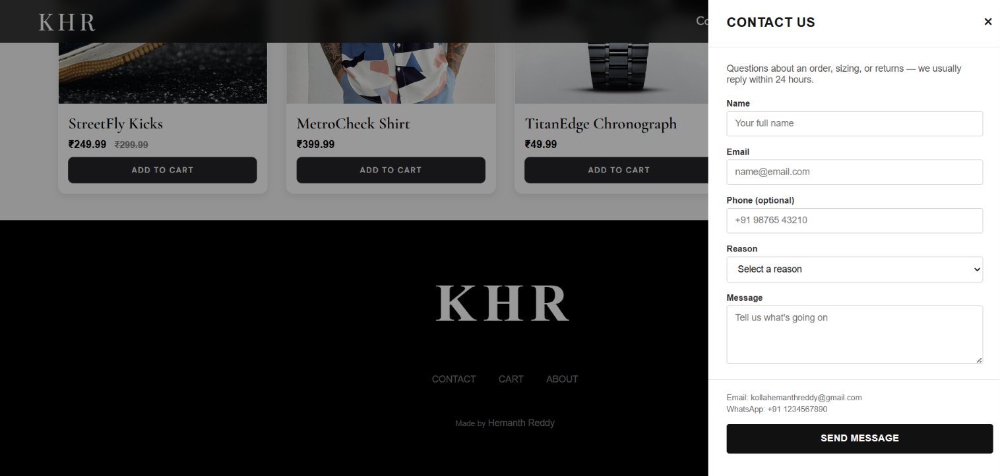

# 👗 KHR Fashions

> A full-stack fashion e-commerce platform built with vanilla JavaScript, Node.js, Express, PostgreSQL, Redis, and Razorpay.

KHR Fashions is a modern fashion e-commerce web application developed as a hands-on full-stack project. It demonstrates frontend development, backend API development, authentication, database integration, Redis-based session management, email services, and online payment integration.

---

## 🌐 Live Demo

**Live Website:**
https://khr7585.github.io/fashion-site/

**GitHub Repository:**
https://github.com/khr7585/fashion-site

---

## ✨ Features

### 🛍️ Shopping Experience

* Product browsing and product detail pages
* Product pages using URL query parameter routing
* Shopping cart
* Wishlist
* Cart and wishlist persistence using `localStorage`
* Multi-step checkout process
* Live product search
* Category-based search filtering
* Interactive contact drawer

### 👤 Authentication

* User registration
* User login
* Email verification
* Password reset
* Transactional emails using Nodemailer
* Session management using Redis

### 💳 Payment

* Razorpay payment integration
* Multi-step checkout flow
* Payment processing through Razorpay

### ⚡ Backend

* REST-style backend APIs
* Node.js and Express server
* PostgreSQL database
* Redis integration
* Environment-based configuration
* Docker support

---

## 🏗️ System Architecture

```text
                    ┌──────────────────────┐
                    │     User Browser     │
                    │                      │
                    │ HTML / CSS / JS      │
                    └──────────┬───────────┘
                               │
                               │ HTTP Requests
                               ▼
                    ┌──────────────────────┐
                    │   Node.js + Express  │
                    │      Backend API     │
                    └───────┬───────┬──────┘
                            │       │
                 ┌──────────┘       └──────────┐
                 ▼                             ▼
        ┌─────────────────┐          ┌─────────────────┐
        │   PostgreSQL    │          │      Redis      │
        │                 │          │                 │
        │ Application     │          │ Session /       │
        │ Data            │          │ Cache           │
        └─────────────────┘          └─────────────────┘
                 │
                 │
                 ▼
        ┌─────────────────┐
        │ External Services│
        │                 │
        │ Razorpay        │
        │ Nodemailer      │
        └─────────────────┘
```

---

## 🛠️ Tech Stack

### Frontend

| Technology   | Purpose                         |
| ------------ | ------------------------------- |
| HTML5        | Page structure                  |
| CSS3         | Styling and responsive UI       |
| JavaScript   | Frontend logic and interactions |
| LocalStorage | Cart and wishlist persistence   |
| GitHub Pages | Frontend deployment             |

### Backend

| Technology | Purpose                               |
| ---------- | ------------------------------------- |
| Node.js    | Backend runtime                       |
| Express.js | API and server framework              |
| PostgreSQL | Persistent data storage               |
| Redis      | Session management / caching          |
| Docker     | Containerization                      |
| Nodemailer | Email verification and password reset |
| Razorpay   | Payment processing                    |

---

## 📁 Project Structure

```text
fashion-site/
│
├── about-page/          # About page
├── backend/             # Express server, API routes and database logic
├── cart-page/           # Shopping cart UI
├── images/              # Static images and assets
├── login-page/          # Login flow
├── product-page/        # Product detail pages
├── register-page/       # Registration and email verification
│
├── index.html           # Home page
├── index.css            # Main stylesheet
├── index.js             # Main frontend JavaScript
│
└── README.md            # Project documentation
```

---

## ⚙️ Getting Started

### Prerequisites

Make sure the following are installed:

* [Node.js](https://nodejs.org/)
* PostgreSQL
* Redis
* Git
* Docker *(optional)*
* Razorpay account *(for payment testing)*

---

## 📥 Installation

### 1. Clone the repository

```bash
git clone https://github.com/khr7585/fashion-site.git
cd fashion-site
```

### 2. Install backend dependencies

```bash
cd backend
npm install
```

### 3. Configure environment variables

Create a `.env` file inside the backend directory.

Example:

```env
DATABASE_URL=your_postgresql_database_url
REDIS_URL=your_redis_url

RAZORPAY_KEY_ID=your_razorpay_key_id
RAZORPAY_KEY_SECRET=your_razorpay_key_secret

SMTP_HOST=your_smtp_host
SMTP_PORT=your_smtp_port
SMTP_USER=your_email
SMTP_PASS=your_email_password
```

> ⚠️ Never commit your `.env` file or real API credentials to GitHub.

### 4. Start the backend

```bash
npm start
```

### 5. Run the frontend

Open the project's `index.html` file or serve the project directory using a local static server.

---

## 🔐 Environment Variables

The backend uses environment variables for configuration and sensitive credentials.

| Variable              | Purpose                  |
| --------------------- | ------------------------ |
| `DATABASE_URL`        | PostgreSQL connection    |
| `REDIS_URL`           | Redis connection         |
| `RAZORPAY_KEY_ID`     | Razorpay public key      |
| `RAZORPAY_KEY_SECRET` | Razorpay secret          |
| `SMTP_HOST`           | Email server             |
| `SMTP_PORT`           | Email server port        |
| `SMTP_USER`           | Email account            |
| `SMTP_PASS`           | Email account credential |

Use your actual variable names from the backend `.env` configuration if they differ from the examples above.

---

## 🔌 Backend & API

The backend is built using Node.js and Express.

It is responsible for:

* User authentication
* Registration
* Email verification
* Password reset
* Product-related API operations
* Database communication
* Redis session management
* Payment-related operations
* Transactional email

> API endpoints can be documented here as the backend API documentation is expanded.

---

## 🔄 Application Flow

### User Authentication

```text
User
  │
  ▼
Registration / Login
  │
  ▼
Express Backend
  │
  ├──► PostgreSQL
  │
  ├──► Redis Session
  │
  └──► Nodemailer
          │
          ▼
     Email Verification
```

### Shopping & Checkout

```text
Browse Products
      │
      ▼
Product Details
      │
      ▼
Cart / Wishlist
      │
      ▼
Multi-Step Checkout
      │
      ▼
Razorpay
      │
      ▼
Payment Processing
```

---

## 🚀 Deployment

### Frontend

The frontend is deployed using **GitHub Pages**.

Live website:

https://khr7585.github.io/fashion-site/

### Backend

The backend can be run separately using Node.js and Express.

Docker support is also included for containerized deployment.

---

## 📸 Screenshots

Add screenshots of your application here to make the repository more attractive to visitors.

Example:







Recommended screenshots:

1. Home page
2. Product page
3. Search interface
4. Cart
5. Wishlist
6. Login/Register

---

## 🗺️ Roadmap

### Documentation

* [ ] Expand backend API documentation
* [ ] Add API request/response examples
* [ ] Add architecture documentation

### Testing

* [ ] Add automated backend tests
* [ ] Add frontend testing
* [ ] Add payment-flow testing

### DevOps

* [ ] Add CI/CD pipeline
* [ ] Improve Docker deployment
* [ ] Add production deployment documentation

### Future Features

* [ ] Admin dashboard
* [ ] Product reviews and ratings
* [ ] Order history
* [ ] Inventory management
* [ ] Advanced product filtering
* [ ] Improved analytics

---

## 🔒 Security Notes

This project uses environment variables to protect sensitive configuration such as:

* Database credentials
* Redis connection details
* Razorpay credentials
* SMTP credentials

Never commit secrets directly into the repository.

Make sure `.env` is included in `.gitignore`:

```gitignore
.env
node_modules/
```

---

## 🎯 Project Objectives

The main objectives of KHR Fashions are to demonstrate practical implementation of:

* Full-stack web development
* REST API development
* Database integration
* User authentication
* Session management
* Redis usage
* Payment gateway integration
* Email verification
* Password reset workflows
* Frontend state persistence
* Docker-based development
* Git and GitHub workflow

---

## 📚 What I Learned

This project provided hands-on experience with:

* Building a full-stack application
* Connecting a frontend to a backend API
* Working with PostgreSQL
* Using Redis for session management
* Implementing authentication flows
* Integrating Razorpay
* Sending transactional emails
* Managing environment variables
* Containerizing applications with Docker
* Deploying frontend applications using GitHub Pages

---

## 🤝 Contributing

Contributions, suggestions, and improvements are welcome.

If you find an issue or have an idea for improving the project:

1. Fork the repository
2. Create a feature branch
3. Make your changes
4. Commit your changes
5. Push the branch
6. Create a Pull Request

---

## 📄 License

This project is licensed under the **MIT License**.

---

## 👨‍💻 Developer

**KHR Fashions**

Built as a full-stack learning and portfolio project using modern web development technologies.

⭐ If you find this project useful, consider giving the repository a star!
